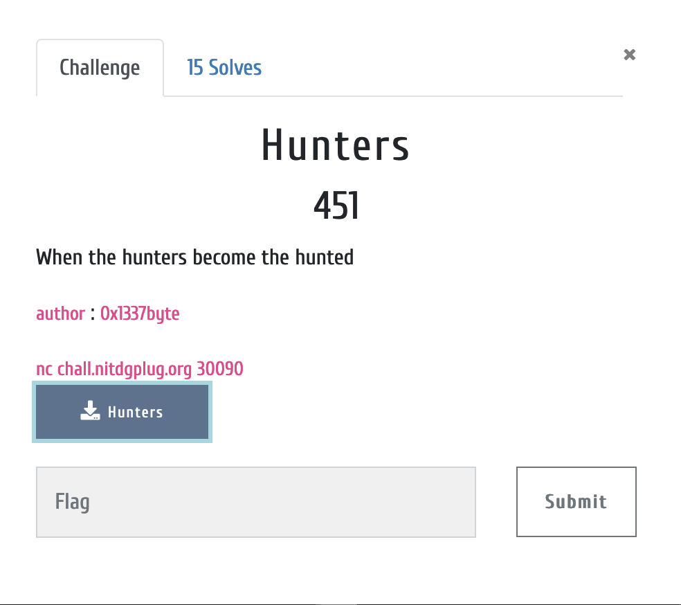
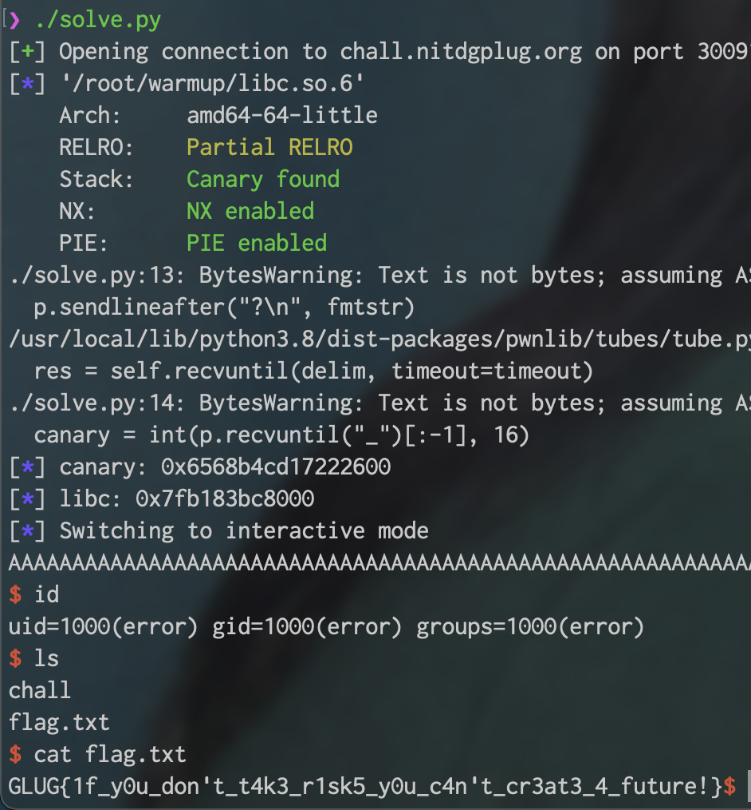

# Binary Specification

> [Hunters](./Hunters)

```c
Hunters: ELF 64-bit LSB shared object, x86-64, version 1 (SYSV), dynamically linked, interpreter /lib64/ld-linux-x86-64.so.2, BuildID[sha1]=8c6e4313c6aa227a8eb692501b09ce4b8dc2ed6c, for GNU/Linux 3.2.0, not stripped
```

```c
❯ checksec Hunters
[*] '/root/Hunters/Hunters'
    Arch:     amd64-64-little
    RELRO:    Full RELRO
    Stack:    Canary found
    NX:       NX disabled
    PIE:      PIE enabled
    RWX:      Has RWX segments
```

ELF 64 and NX disabled.

* * *

# Description



I could not decompile with ida because of some error. Just debugging with gdb only.

The binary has twice input, first input is stored `$rbp-0x240` and second input is stored `$rbp-0x220`.

After then binary is run follow code.

```
lea rdx, [rbp-0x240]
mov eax, 0x0
call rdx
```

That mean we can run some shellcode. But 1 problem is there.

Binary has unkown 8 byte value between first input and second input so SIGSEGV or something error is occurred.

If i know there value we can modify shellcode but in remote, value is changed every try.

Few tries after, i realized awesome way for getting shell. In first input enter the follow code.

```
lea rdx, [rbp-0x220]
xor rax, rax
call rdx
```

And a second input, enter full shellcode. This way is successfully work but it's unintended solution :cry:

* * *

# Flag



* * *

# Exploit Code

> [Exploit Code](./solve.py)
