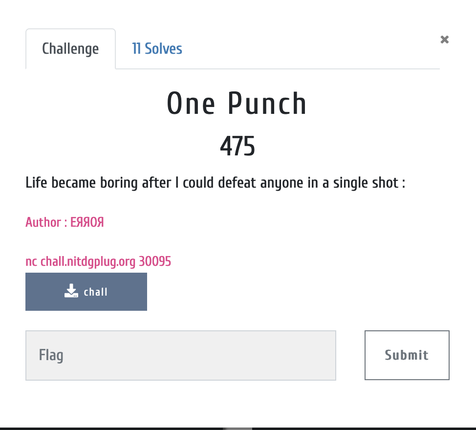
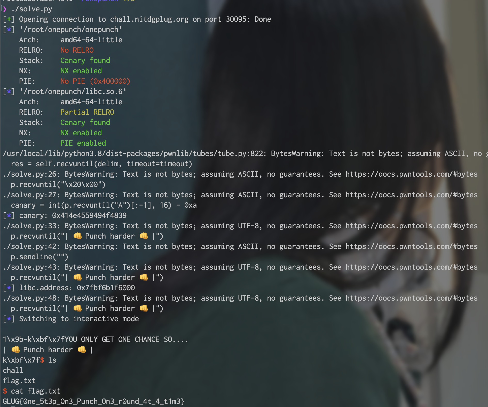

# Binary Specification

> [Binary](./onepunch.zip)

```c
onepunch: ELF 64-bit LSB executable, x86-64, version 1 (SYSV), dynamically linked, interpreter /lib64/ld-linux-x86-64.so.2, BuildID[sha1]=73c1df7918bed72d62373c32ad0ce5841e642813, for GNU/Linux 3.2.0, not stripped
```

```c
❯ checksec onepunch 
[*] '/root/onepunch/onepunch'
    Arch:     amd64-64-little
    RELRO:    No RELRO
    Stack:    Canary found
    NX:       NX enabled
    PIE:      No PIE (0x400000)
```

* * *

# Description



This binary has also **format string bug** but only once input and output. This mean we need to find different way to control **Program Counter**.

If i try to manipulate ret address, always meet "Stack Smashing" because of canary. I think out from `__stack_chk_fail()` that reason why binary is 'No RELRO'.

If i changed `__stack_chk_fail()` GOT address to `vuln()`, we can control when canary is not correct.

It's work clearly good and i liked this way. I'm keeping try to leak canary for stack buffer overflow but there's a one problem.

`fgets()` is add **NULL** terminate character and last byte of canary is `0x00`. In my idea, canary is must be changed incorrect value. To that, i manipulate 1 byte but after that add NULL.

Now, binary is return 2 byte incorrect canary. It's failed.

I'm solve this challenge unintenitionally with magic.

1. Manipulate ret with incorrect canary
2. `vuln()` is called because of `__stack_chk_fail()` is spoofed.
3. If just send enter(0x0a), successfully manipulated.

I don't sure why it work this. From this result, i think one more idea and finally exploit is succeed.

* * *

# Flag



* * *

# Exploit Code

> [exploit](./solve.py)
