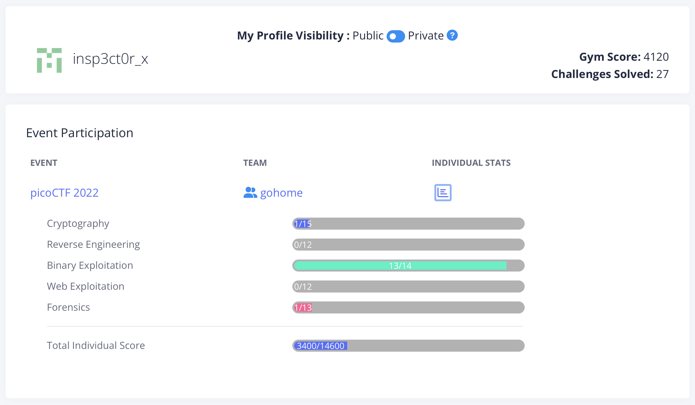

# Score

* * *

# Description

총 14개의 binary exploitation 문제 중 13개를 해결하였습니다. 문제의 난이도는 대체로 쉬운 편이었으나, 마지막 crypto currency와 관련된 문제가 어려워 해결하지 못했습니다.

또한 일부 문제에 대해 분명 알고 있는 개념임에도 몇 가지 issue로 인해 debugging을 통해 해결한 점이 아쉽게 남았습니다.

Write-Up은 별도로 작성하지 않았으며 대부분의 문제는 [picoCTF 홈페이지](https://picoctf.org)에 올라와 있기 때문에 관심이 있으시다면 진행해보면 좋을 것 같습니다.
